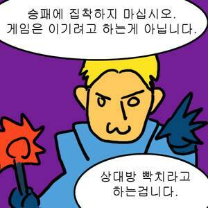
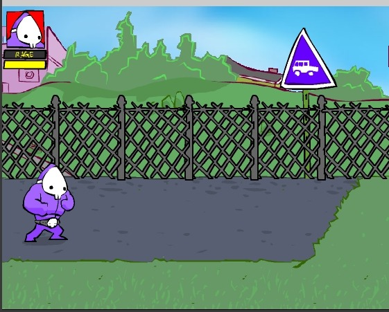
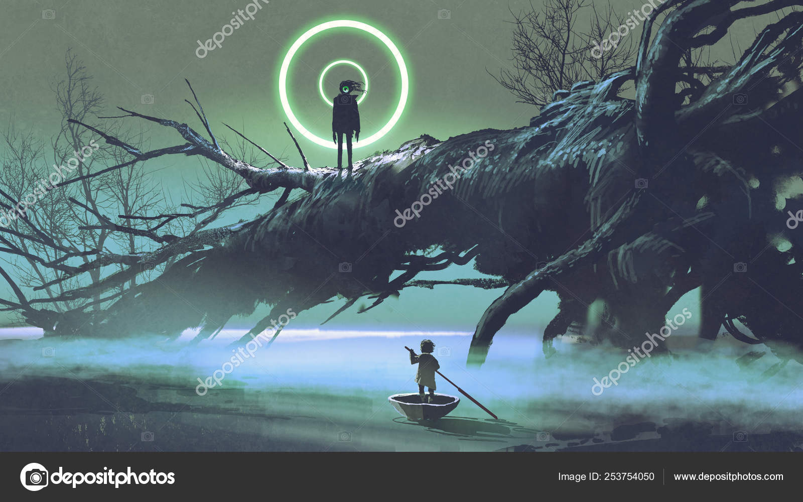
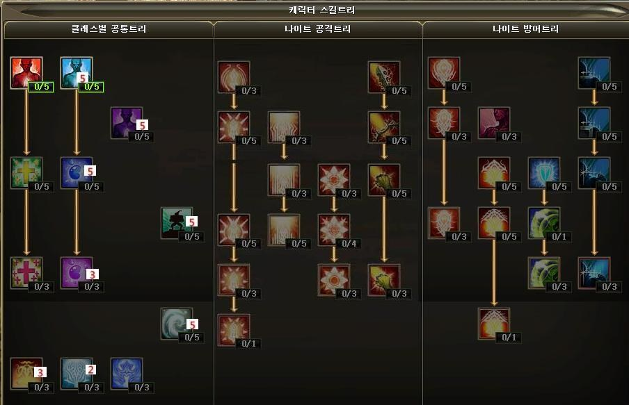
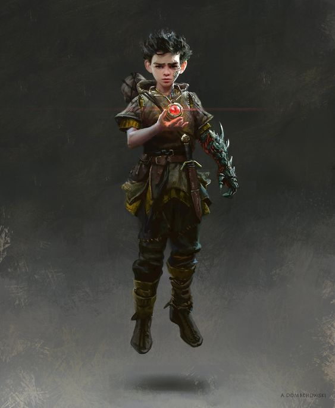
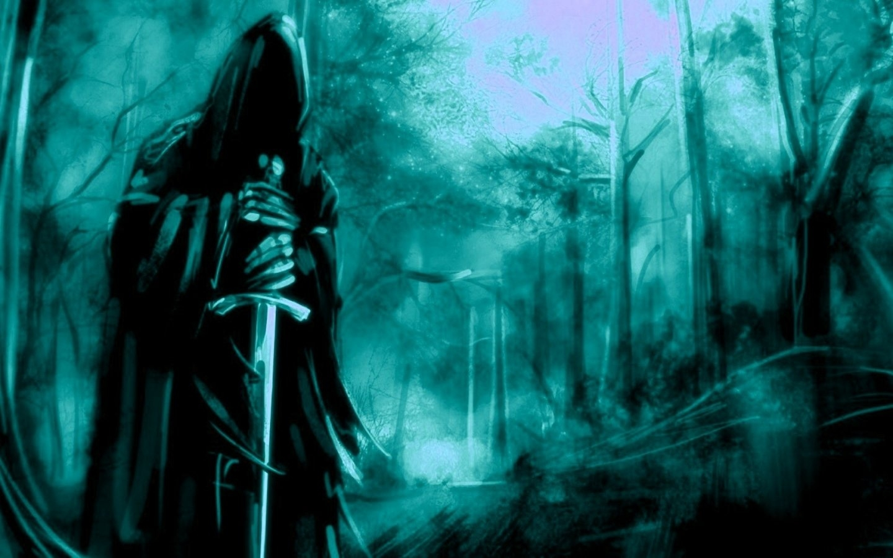
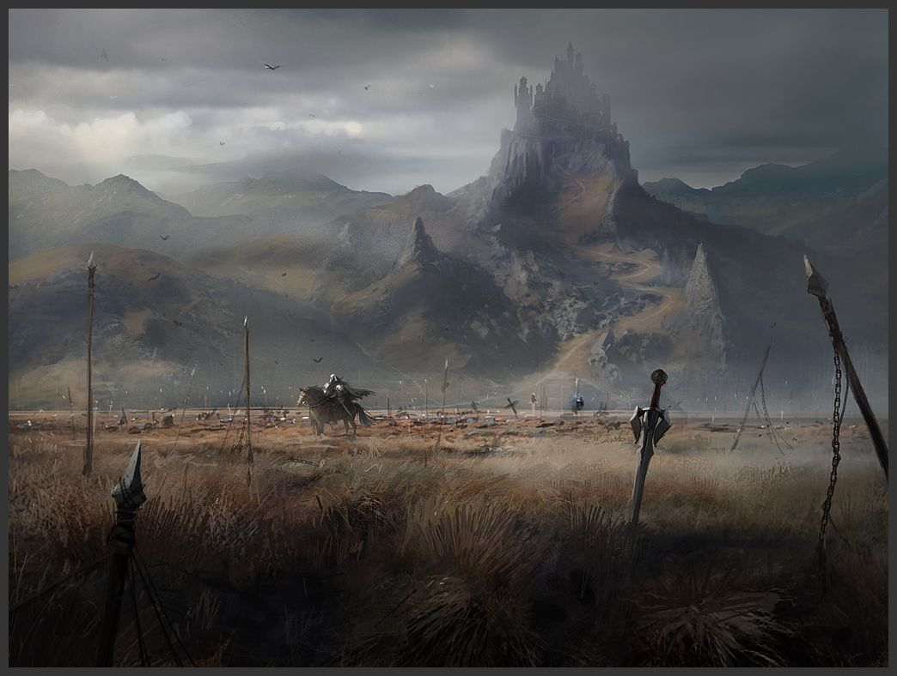
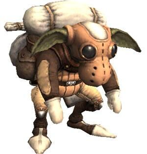
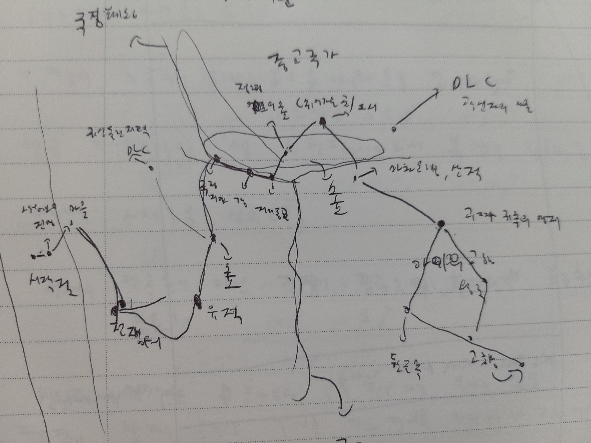

# D's travel 설계 발표

## D's travel 목차
 ## [컨셉](#목차)  
 ## [관련 이미지 관련 동영상](#관련-이미지와-관련-동영상)  
 ## [컨셉과 대표 이미지](#컨셉과-대표-이미지)
 ## [게임구성요소](#게임구성요소)
 ## [게임 시스템 디자인](#게임-시스템-디자인)
 ## [개발 요구사항과 흐름도](#개발-요구사항과-흐름도)
 ## [스토리보드](#스토리보드)
 ## [개발작업 일정](#개발작업-일정)

# 컨셉

## 메인 컨셉 : 나약함
### 모험과 스토리  
    
- 각자의 목표를 위해  같이 모험을 떠나는 두 캐릭터의 이야기 

### 나약함과 협력   
  
- 전투를 못하는 player와 전투가 가능한 npc를 이용
    
- 플레이어가 메인으로 할 수 있는 것은 오직 전투를 회피하는 것일  뿐 

## 서브컨셉1 : 캐릭터

- 메인이 되는 캐릭터는 2명

  - 아이 :  기억 일부를 잃은 소년 병(플레이어)
    		아이는 전투를 못함. 공격은 전부 회피 또는 버텨야 함.
		도구와 스킬을 이용하여 위급한 상황을 극복할 수 있음

## 서브컨셉2 : 패턴

- 게임에 등장하는 다양한 적들은 일정한 공격패턴을 가짐.
- 공격을 하기전의 패턴을 보고 플레이어는 피해야 함
- 스테이지에는 중간보스와 최종보스를 넣을 계획. 
- 더욱 강력한 공격을 가함
- 공격을 당해 데미지를 입으면 체력이 깍이고,  0이 되어 아이가 죽으면 게임오버

## 서브컨셉3 : 협력과 전략 

- 아이(플레이어)는 전투는 불가하지만 도구를 이용하여 적들의 행동에 제약을 주거나 남자에게 수신호를 보내서 스킬을 쓰거나 적 하나를 마크하여 공격 할 수 있음
- 이러한 시스템을 이용하여 같은 전투여도 다양하게 싸울 수 있도록 할 예정

## 서브컨셉4 : 스킬

전투를 통하여 스킬 포인트를 얻을 수 있음

- 초반에 어떤 스킬을 올리냐에 따라서 그 후의 전투 방식이 바뀜
    -  ex)아이  
		-탱커계열:오래 버팀

		-도구계열: 더 많은 도구를 소지 할 수 있음.
	   
	   ex)남자   
	    -스킬 계열: 더 다양한 스킬로 적을 제거

## 서브컨셉5 : 로그라이'트'

- 게임은 스테이지 방식으로 구성된다.
- 전투도중에 죽을 경우 그 스테이지 처음부터 플레이 해야 함
맵 중간의 중간보스를 제거 할 경우 자동으로 체크포인트가 된다
- 체크포인트가 될 경우, 체력 회복 등의 부가요소도 넣을지 고려 중

## 서브컨셉6 : 긴박감

- 스테이지를 넘어갈수록, 맵의 끝으로 향할수록 적들은 점점 다양해지고, 많아지고, 그만큼 강력하고 빠른 패턴을 사용.
	
- 그러한 점을 이용하여 플레이어가 계속 긴박감을 유지할 수 있게 하는 것이 목표.
	
	- (그리고 중간에 죽어서 다시 해야 할 경우, 사람을 화나게 하는 것도 목표(?))

## 서브컨셉(?) : 욕심과 목표

- 게임개발자가 자신이 원하는 게임을 만들기는 외적과 내적인 이유로 굉장히 힘들다고 한다.

- 본인 또한 나중에 이쪽 일을 하게 된다면, 본인이 원하는 게임을 만들기 힘들기 때문에 그 동안 속으로만 기획하던 것 중에서 하나를 이렇게라도 한번 만들어 볼까 하고 고민하였고 이렇게 발표하게 되었다.

 # 관련 이미지와 관련 동영상

  
  

 - 비슷한 플레이 영상

 - 비슷한 게임 시점

 - 비슷한 컨셉 일러스트

 - 게임 스킬창 이미지

# 컨셉과 대표 이미지

## 컨셉
 - 현재 메인이 되는 캐릭터들과 그 외의 여러 배경컨셉을 설명.
 - 캐릭터는 2등신으로 만들 예정, 여기서 나오는 일러스트는 어디까지나 컨셉 일러스트라는 것

## 캐릭터

 - 캐릭터는 총 두 명. 아이와 남자
 - 아이같은 경우는 나약하지만 고난을 겪었기 때문에 정신적으로 살짝 성숙하다는 느낌의 컨셉
 - 남자같은 경우는 정체를 알 수 없다 라는느낌을  메인으로 삼음

 ## 플레이어블 캐릭터

 - 초반 컨셉 일러스트

- 플레이어 캐릭터 ‘남자아이’

 - NPC 정체불명의 '남자'

 ## 스테이지 컨셉

  
 - 스테이지는 여러 개를 구상하였으나, 시간내로 전부  제작 할 수 없는 관계로 첫번째 스테이지만 구상하고 만들 계획
 - 전쟁이 끝난 벌판
 - 스토리의 시작부분이자 튜토리얼 파트

 

 - 스테이지 1 전쟁 끝난 벌판

 - 스테이지1 메인 몬스터 ‘시체꾼’

 ## 스토리 컨셉

 - 스토리의 메인 컨셉은 전쟁, 광신, 신의 존재 그리고 불가사의함
 - 아이디어는 워해머 판타지와 크툴루 신화 소설의 ‘벽속의 쥐’에서 얻음

- 세계관 지도 (손그림)

## 작품묘사

 
 - 시작화면

- 다음 화면

 - 플레이 화면

# 게임구성요소

## 1. 매커니즘

### 도전과제 

- 아이를 조종하여 스테이지를 클리어하라.
  
- 아이를 조종하여 적의 공격을 최대한 많이 회피하라.
남자를 조종하여 적을 공격하여 쓰러뜨려라.

### 재미요소
 - 스테이지를 클리어 하여 얻는 포인트로 여러 가지 스킬을 배워 전투를 보조할 수 있다.
 - 그 스킬 포인트를 어디에 투자하냐에 따라서 아이의 회피방식과 남자의 전투방식이 달라진다.
 - 적을 없애면서 얻는 랜덤한 재료들을 조합하여 만든 도구들로 위급한 상황을 극복 할 수 있다. 
 - 스테이지의 끝으로 갈수록 다양한 적들의 공격 패턴이 나온다.

## 2. 스토리

 - 남자는 자신의 임무를, 아이는 집에 가고 싶다는 목표를 위해 여러 지역을 다니는 것이 기본 스토리 
 - 저번에도 얘기했지만, 소설 벽속의 쥐와 워해머 판타지에서 아이디어를 얻음.

 ### 시놉시스
	
한 아이가 있었습니다. 어디에서나 볼 수 있는 평범한 아이였습니다. 하지만 불행히도 아이는 마을 밖을 돌아다니다가 납치를 당하였고, 전쟁 중이던 이웃나라로 팔려가고 말았습니다. 그 후에 무슨 일이 있었는지는 아이는 기억하지 못했습니다만, 마지막으로 기억이 돌아왔을 때, 아이는 전쟁 한복판에서 전투가 준비 중이였습니다. 치열한 전투가 진행되던 중에 아이는 두려움에 떨며 숨었습니다. 그렇게 누구에게도 들키지 않으면서 숨은 아이는 전투가 끝난 후 슬그머니 숨은 곳에서 나왔습니다. 사방은 시체투성이 였습니다. 아이는 집에 가고 싶어했지만, 자신이 집에 가지 못할 거라는 생각에 절망했습니다. 그런데 그 순간 아이는 어떤 남자가 전쟁터를 지나가는 것을 보았습니다. 검은 망토를 두른 남자였습니다. 방법이 없던 아이는 그 남자를 그냥 따라갔습니다. 그렇게 두 사람의 이야기가 시작되었습니다.

   ### stage1 전투 끝난 벌판
	
전투 끝에는 죽음이 있습니다. 하지만 죽음만 있는 것은 아닙니다. 포식하게 될 까마귀와 살아남은 말, 그리고 겨우 목숨을 부지한 패잔병들과 한 푼이라도 벌어보려는 시체꾼들이 생존을 위해 싸우기 시작합니다. 남자와 아이의 생존을 위한 싸움도 시작합니다. 

## 3. 미적요소	

 - 디자인: 다양한 타입의 패잔병들과 시체꾼들 그리고    남자의 다양한 스킬 액션 등등
 - 캐릭터는 보통 2등신~3등신으로 구성할 예정(보스는 제외)
 - 배경: 스테이지마다 그 스테이지만의 독특한 요소를 넣을 예정
	  
	    
	  1스테이지 같은 경우는 데미지를 입는 불이라던가, 이동을 막는 목책이나 시체 산 등을 고려 중 

- 음향: 시작페이지,스테이지 ,중간보스, 스테이지 최종보스로 나누어서 4가지 음악을 넣을 예정

## 4. 기술

 - 기본 베이스는 게임엔진 유니티(unity)를 사용할 예정.(그외의 요소들은 에셋스토어를 사용할 예정)
 - 적들에게는 일정한 공격패턴을 프로그래밍 할 예정.
 - 가장 중요한 남자의 AI(자동공격)에 많이 집중할 생각.

# 게임 시스템 디자인

## 게임 오브젝트 분해

|번호|이름|이미지|비고|
|--|--|--------|-|
|1|배경|||
|2|울타리|ㅁㅁ||
|3|불|ㅁㅁ||
|4|UI|ㅁㅁ||
|5|시체더미|ㅁㅁ||
|6|아이|ㅁㅁ||
|7|남자|ㅁㅁ||
|8|몬스터들|ㅁㅁ|자세한 내용은 아래쪽에|

## 파라미터(속성) 뽑아보기

1)오브젝트 이름: 죽어가는 병사(검)  

|속성|속성 값|설명|비고| 
|------|---|---|---|
|무기|검|
|체력|5|
|공격거리|1|
|공격방법횟수|1|

2)오브젝트 이름: 죽어가는 병사(창)  

|속성|속성 값|설명|비고| 
|------|---|---|---|
|무기|창|
|체력|5|
|공격거리|2|
|공격방법횟수|1|

3)오브젝트 이름: 죽어가는 병사(활)  

|속성|속성 값|설명|비고| 
|------|---|---|---|
|무기|활|
|체력|4|
|공격거리|한 줄|
|공격방법횟수|1|

4)오브젝트 이름: 죽어가는 병사(방패)  

|속성|속성 값|설명|비고| 
|------|---|---|---|
|무기|창과 방패|
|체력|6|
|공격거리|1|
|공격방법횟수|1|

5)오브젝트 이름: 시체 까마귀  

|속성|속성 값|설명|비고| 
|------|---|---|---|
|무기|발톱,부리|
|체력|3|
|공격거리|1칸, 3칸|
|공격방법횟수|2|

6)오브젝트 이름: 시체꾼  

|속성|속성 값|설명|비고| 
|------|---|---|---|
|무기|단검|
|체력|10|
|공격거리|1|
|공격방법횟수|1|

7)오브젝트 이름: 거대한 시체 까마귀  

|속성|속성 값|설명|비고| 
|------|---|---|---|
|무기|발톱,부리,날개|
|체력|50|
|공격거리|1|
|공격방법횟수|6|

8)오브젝트 이름: 베테랑 시체꾼  

|속성|속성 값|설명|비고| 
|------|---|---|---|
|무기|단검|
|체력|100|
|공격거리||
|공격방법횟수|8|

## D's travel의 요구사항

- 시작화면, 설정화면, 게임화면 총 3가지가 있다.

- 시작화면에는 게임시작, 설정, 끝내기버튼, 총 - 3가지가 있다.

- 끝내기버튼 클릭시 화면이 종료된다.

- 설정버튼 클릭시 설정화면으로 이동한다.

- 설정화면에는 화면조절,소리조절,조작키조절이 가능하다.

- 시작화면 클릭 시 저장기록이 담긴 화면이 나온다.

- 저장화면에서는 총 3개의 불러오기가 가능하다.

- 약간의 스토리가 컷씬으로 나온 후 게임이 시작된다.

- 시작하면 몇분 가량의 튜토리얼을 하게된다.

- 게임화면에서는 아이와 남자 그리고 몬스터가 등장한다.

- 게임화면에서는 아이의 스킬창과 남자의 스킬창이 나온다.

- 적은 아이를 중심으로 공격한다.

- 적들또한 몇가지의 공격패턴을 가지고 있다.

- 아이(조종 캐릭터)가 죽으면 게임오버

- 스테이지 끝까지 진행하여 최종보스까지 제거하면 스테이지 클리어

- 저장은 불가능하며, 중간보스를 해치울시, 최종보스를 해치울시  자동저장이 가능하다.

- 남자는 조종불가능하지만 무적이며, 적들을 자동으로 공격한다. 하지만 CC로 인한 전투중지는 가능하다.
공격지정과 스킬사용만 조종가능 하다.

- 스테이지마다 보스는 총 2명(중간보스,최종보스)

- 적을 없앨 때 마다 얻는 경험치로 스킬포인트를 얻을수 있다.

- 스킬포인트로 캐릭터를 강화할수있으며, 스킬 트리는 총 3가지이다. 

- 게임은 키보드로 조작가능하다.

- esc키로 일시정지가 가능하며, 게임을 나가거나 설정변경이 가능하다.

