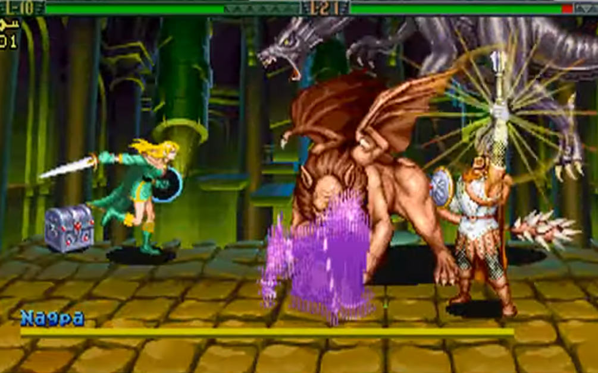
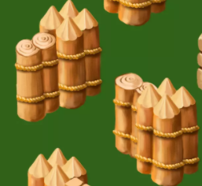
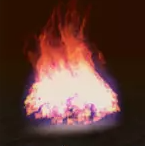
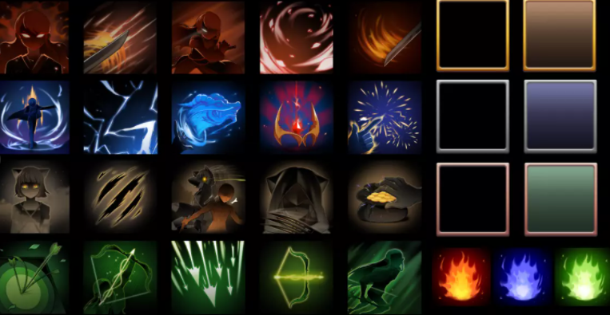
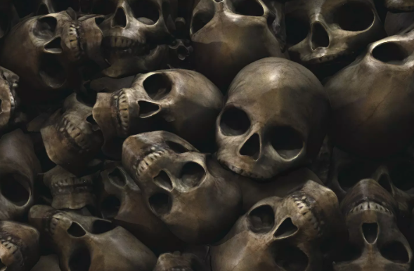
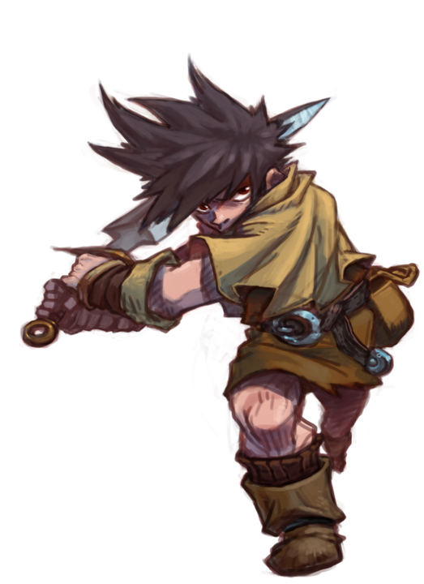
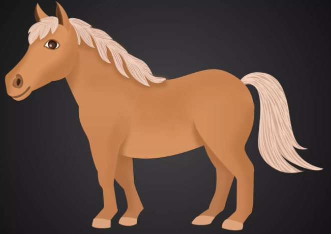
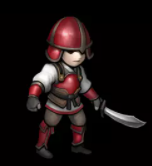
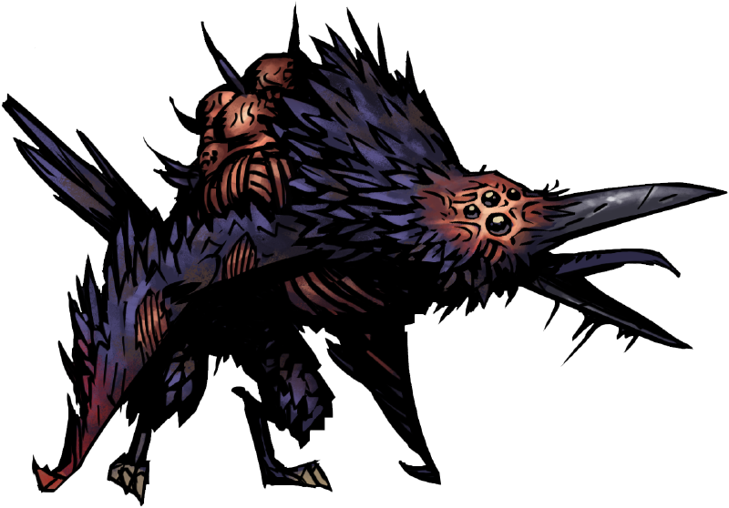

# D's travel 설계 발표

## D's travel 목차

## [컨셉](#목차)    
## [관련 이미지 관련 동영상](#관련-이미지와-관련-동영상)    
## [컨셉과 대표 이미지](#컨셉과-대표-이미지)  
## [게임구성요소](#게임구성요소)  
## [게임 시스템 디자인](#게임-시스템-디자인)  
## [개발 요구사항과 흐름도](#개발-요구사항과-흐름도)  
## [스토리보드](#스토리보드)  
## [개발작업 일정](#개발작업-일정)  

# 컨셉

## 메인 컨셉 : 나약함
### 모험과 스토리  
    
- 각자의 목표를 위해  같이 모험을 떠나는 두 캐릭터의 이야기 

### 나약함과 협력   
  
- 전투를 못하는 player와 전투가 가능한 npc를 이용
    
- 플레이어가 메인으로 할 수 있는 것은 오직 전투를 회피하는 것일  뿐 

## 서브컨셉1 : 캐릭터

- 메인이 되는 캐릭터는 2명

  - 아이 :  기억 일부를 잃은 소년 병(플레이어)
    		아이는 전투를 못함. 공격은 전부 회피 또는 버텨야 함.
		도구와 스킬을 이용하여 위급한 상황을 극복할 수 있음

## 서브컨셉2 : 패턴

- 게임에 등장하는 다양한 적들은 일정한 공격패턴을 가짐.
- 공격을 하기전의 패턴을 보고 플레이어는 피해야 함
- 스테이지에는 중간보스와 최종보스를 넣을 계획. 
- 더욱 강력한 공격을 가함
- 공격을 당해 데미지를 입으면 체력이 깍이고,  0이 되어 아이가 죽으면 게임오버

## 서브컨셉3 : 협력과 전략 

- 아이(플레이어)는 전투는 불가하지만 도구를 이용하여 적들의 행동에 제약을 주거나 남자에게 수신호를 보내서 스킬을 쓰거나 적 하나를 마크하여 공격 할 수 있음
- 이러한 시스템을 이용하여 같은 전투여도 다양하게 싸울 수 있도록 할 예정

## 서브컨셉4 : 스킬

전투를 통하여 스킬 포인트를 얻을 수 있음

- 초반에 어떤 스킬을 올리냐에 따라서 그 후의 전투 방식이 바뀜
    -  ex)아이  
		-탱커계열:오래 버팀

		-도구계열: 더 많은 도구를 소지 할 수 있음.
	   
	   ex)남자   
	    -스킬 계열: 더 다양한 스킬로 적을 제거

## 서브컨셉5 : 로그라이'트'

- 게임은 스테이지 방식으로 구성된다.
- 전투도중에 죽을 경우 그 스테이지 처음부터 플레이 해야 함
맵 중간의 중간보스를 제거 할 경우 자동으로 체크포인트가 된다
- 체크포인트가 될 경우, 체력 회복 등의 부가요소도 넣을지 고려 중

## 서브컨셉6 : 긴박감

- 스테이지를 넘어갈수록, 맵의 끝으로 향할수록 적들은 점점 다양해지고, 많아지고, 그만큼 강력하고 빠른 패턴을 사용.
	
- 그러한 점을 이용하여 플레이어가 계속 긴박감을 유지할 수 있게 하는 것이 목표.
	
	- (그리고 중간에 죽어서 다시 해야 할 경우, 사람을 화나게 하는 것도 목표(?))

## 서브컨셉(?) : 욕심과 목표

- 게임개발자가 자신이 원하는 게임을 만들기는 외적과 내적인 이유로 굉장히 힘들다고 한다.

- 본인 또한 나중에 이쪽 일을 하게 된다면, 본인이 원하는 게임을 만들기 힘들기 때문에 그 동안 속으로만 기획하던 것 중에서 하나를 이렇게라도 한번 만들어 볼까 하고 고민하였고 이렇게 발표하게 되었다.

# 관련 이미지와 관련 동영상

  
  

 - 비슷한 플레이 영상

  

 - 비슷한 게임 시점

 

 - 비슷한 컨셉 일러스트

 - 게임 스킬창 이미지

# 컨셉과 대표 이미지

## 컨셉
 - 현재 메인이 되는 캐릭터들과 그 외의 여러 배경컨셉을 설명.
 - 캐릭터는 2등신으로 만들 예정, 여기서 나오는 일러스트는 어디까지나 컨셉 일러스트라는 것

## 캐릭터

 - 캐릭터는 총 두 명. 아이와 남자
 - 아이같은 경우는 나약하지만 고난을 겪었기 때문에 정신적으로 살짝 성숙하다는 느낌의 컨셉
 - 남자같은 경우는 정체를 알 수 없다 라는느낌을  메인으로 삼음

## 플레이어블 캐릭터

 - 초반 컨셉 일러스트

- 플레이어 캐릭터 ‘남자아이’

 - NPC 정체불명의 '남자'

## 스테이지 컨셉

  
 - 스테이지는 여러 개를 구상하였으나, 시간내로 전부  제작 할 수 없는 관계로 첫번째 스테이지만 구상하고 만들 계획
 - 전쟁이 끝난 벌판
 - 스토리의 시작부분이자 튜토리얼 파트

 

 - 스테이지 1 전쟁 끝난 벌판

 - 스테이지1 메인 몬스터 ‘시체꾼’

## 스토리 컨셉

 - 스토리의 메인 컨셉은 전쟁, 광신, 신의 존재 그리고 불가사의함
 - 아이디어는 워해머 판타지와 크툴루 신화 소설의 ‘벽속의 쥐’에서 얻음

- 세계관 지도 (손그림)

## 작품묘사

 
 - 시작화면

- 다음 화면

 - 플레이 화면

# 게임구성요소

## 1. 매커니즘

### 도전과제 

- 아이를 조종하여 스테이지를 클리어하라.
  
- 아이를 조종하여 적의 공격을 최대한 많이 회피하라.
남자를 조종하여 적을 공격하여 쓰러뜨려라.

### 재미요소
 - 스테이지를 클리어 하여 얻는 포인트로 여러 가지 스킬을 배워 전투를 보조할 수 있다.
 - 그 스킬 포인트를 어디에 투자하냐에 따라서 아이의 회피방식과 남자의 전투방식이 달라진다.
 - 적을 없애면서 얻는 랜덤한 재료들을 조합하여 만든 도구들로 위급한 상황을 극복 할 수 있다. 
 - 스테이지의 끝으로 갈수록 다양한 적들의 공격 패턴이 나온다.

## 2. 스토리

 - 남자는 자신의 임무를, 아이는 집에 가고 싶다는 목표를 위해 여러 지역을 다니는 것이 기본 스토리 
 - 저번에도 얘기했지만, 소설 벽속의 쥐와 워해머 판타지에서 아이디어를 얻음.
  

###  시놉시스
	
한 아이가 있었습니다. 어디에서나 볼 수 있는 평범한 아이였습니다. 하지만 불행히도 아이는 마을 밖을 돌아다니다가 납치를 당하였고, 전쟁 중이던 이웃나라로 팔려가고 말았습니다. 그 후에 무슨 일이 있었는지는 아이는 기억하지 못했습니다만, 마지막으로 기억이 돌아왔을 때, 아이는 전쟁 한복판에서 전투가 준비 중이였습니다. 치열한 전투가 진행되던 중에 아이는 두려움에 떨며 숨었습니다. 그렇게 누구에게도 들키지 않으면서 숨은 아이는 전투가 끝난 후 슬그머니 숨은 곳에서 나왔습니다. 사방은 시체투성이 였습니다. 아이는 집에 가고 싶어했지만, 자신이 집에 가지 못할 거라는 생각에 절망했습니다. 그런데 그 순간 아이는 어떤 남자가 전쟁터를 지나가는 것을 보았습니다. 검은 망토를 두른 남자였습니다. 방법이 없던 아이는 그 남자를 그냥 따라갔습니다. 그렇게 두 사람의 이야기가 시작되었습니다.

###  stage1 전투 끝난 벌판
	
전투 끝에는 죽음이 있습니다. 하지만 죽음만 있는 것은 아닙니다. 포식하게 될 까마귀와 살아남은 말, 그리고 겨우 목숨을 부지한 패잔병들과 한 푼이라도 벌어보려는 시체꾼들이 생존을 위해 싸우기 시작합니다. 남자와 아이의 생존을 위한 싸움도 시작합니다. 

## 3. 미적요소	

 - 디자인: 다양한 타입의 패잔병들과 시체꾼들 그리고    남자의 다양한 스킬 액션 등등
 - 캐릭터는 보통 2등신~3등신으로 구성할 예정(보스는 제외)
 - 배경: 스테이지마다 그 스테이지만의 독특한 요소를 넣을 예정
	  
	    
	  1스테이지 같은 경우는 데미지를 입는 불이라던가, 이동을 막는 목책이나 시체 산 등을 고려 중 

- 음향: 시작페이지,스테이지 ,중간보스, 스테이지 최종보스로 나누어서 4가지 음악을 넣을 예정

## 4. 기술

 - 기본 베이스는 게임엔진 유니티(unity)를 사용할 예정.(그외의 요소들은 에셋스토어를 사용할 예정)
 - 적들에게는 일정한 공격패턴을 프로그래밍 할 예정.
 - 가장 중요한 남자의 AI(자동공격)에 많이 집중할 생각.

# 게임 시스템 디자인

## 게임 오브젝트 분해

#### 몬스터들의 이미지는 제작과정중에 달라질 수 있습니다.

|번호|이름|이미지|비고|
|--|--|--------|-|
|1|배경||
|2|울타리||
|3|불||
|4|UI||
|5|시체더미||
|6|아이||
|7|남자||
|8|말||
|9|몬스터들||자세한 내용은 아래쪽에|
|10|보스 몬스터들||자세한 내용은 아래쪽에|

## 파라미터(속성) 뽑아보기

### 플레이어블 캐릭터

1)오브젝트 이름: 아이  

|속성|영문명칭|설명|비고| 
|------|---|---|---|
|체력|3|데미지를 입을때마다 1씩 줄어든다|
|속도|1|아이의 이동속도|
|스킬 개수|2| 사용가능 한 스킬 개수|

2)오브젝트 이름: 남자

|속성|속성 값|설명|비고| 
|------|---|---|---|
|무기|검|전투 가능한 무기|
|체력|X| 무적이기 때문에 체력이 없다|
|공격거리|1|공격 가능한 거리|
|이동속도|1|남자의 이동속도|
|스킬 개수|2| 사용가능 한 스킬 개수|

### 일반 오브젝트

2)오브젝트 이름: 울타리

|속성|속성 값|설명|비고| 
|------|---|---|---|
|체력|20| 울타리는 통과할 수 없다|

2)오브젝트 이름: 불

|속성|속성 값|설명|비고| 
|------|---|---|---|
|체력|X| 무적이기 때문에 체력이 없다|
|데미지|1|닿으면 데미지를 입는다|

2)오브젝트 이름: 날뛰는 말

|속성|속성 값|설명|비고| 
|------|---|---|---|
|체력|X| 무적이기 때문에 체력이 없다|
|공격거리|한 줄|공격 가능한 거리|
|이동속도|5|말의 이동속도|

3)오브젝트 이름: 시체더미

|속성|속성 값|설명|비고| 
|------|---|---|---|
|체력|10|체력있는 방해물|

4)오브젝트 이름: 날뛰는 말

|속성|속성 값|설명|비고| 
|------|---|---|---|
|체력|X| 무적이기 때문에 체력이 없다|
|공격거리|1|
|공격방법횟수|1|

### 몬스터 오브젝트

1)오브젝트 이름: 죽어가는 병사(검)

|속성|속성 값|설명|비고| 
|------|---|---|---|
|무기|검|데미지를 주기위한 무기|
|체력|5|0이 되면 죽는다|
|공격거리|1칸, 3칸|
|공격방법횟수|2||튜토리얼은 1개만 사용한다|

2)오브젝트 이름: 죽어가는 병사(창)

|속성|속성 값|설명|비고| 
|------|---|---|---|
|무기|검|데미지를 주기위한 무기|
|체력|5|0이 되면 죽는다|
|공격거리|2칸, 4칸|
|공격방법횟수|2||튜토리얼은 1개만 사용한다|

3)오브젝트 이름: 죽어가는 병사(활)

|속성|속성 값|설명|비고| 
|------|---|---|---|
|무기|활|데미지를 주기위한 무기|
|체력|3|0이 되면 죽는다|
|공격거리|1줄|
|공격방법횟수|1||튜토리얼은 1개만 사용한다|

4)오브젝트 이름: 죽어가는 병사(방패)

|속성|속성 값|설명|비고| 
|------|---|---|---|
|무기|방패,창|데미지를 주기위한 무기|
|체력|7|0이 되면 죽는다|
|공격거리|2칸, 3칸|
|공격방법횟수|2||튜토리얼은 1개만 사용한다|

5)오브젝트 이름: 시체 까마귀

|속성|속성 값|설명|비고| 
|------|---|---|---|
|무기|부리,발톱|데미지를 주기위한 무기|
|체력|3|0이 되면 죽는다|
|공격거리|1칸, 3칸|
|공격방법횟수|2||

6)오브젝트 이름: 시체꾼

|속성|속성 값|설명|비고| 
|------|---|---|---|
|무기|단검, 섬광탄, 검|데미지를 주기위한 무기|
|체력|12|0이 되면 죽는다|
|공격거리|1칸, 2칸|
|공격방법횟수|2~3|

### 보스 몬스터

1)오브젝트 이름: 거대한 시체 까마귀

|속성|속성 값|설명|비고| 
|------|---|---|---|
|무기|부리, 발톱, 날개|데미지를 주기위한 무기|
|체력|50|0이 되면 죽는다|
|공격범위|9칸(3X3칸), 6칸(2X3칸),5칸|
|공격방법횟수|4|

2)오브젝트 이름: 베테랑 시체꾼

|속성|속성 값|설명|비고| 
|------|---|---|---|
|무기|단검, 채찍, 섬광탄|데미지를 주기위한 무기|
|체력|75|0이 되면 죽는다|
|공격거리|1칸|
|공격방법횟수|5|

## 오브젝트의 행동

### 플레이어블 캐릭터

1)오브젝트 이름: 아이  

|행동|설명|
|------|---|
|이동|방향키를 이용한 이동|
|구르기|스페이스바를 이용한 일반 스킬|
|도구사용|자판을 이용한 도구사용 |
|명령|남자에게 명령하는 스킬|
|스킬|위기를 대처하는 스킬|

2)오브젝트 이름: 남자

|행동|설명| 
|------|---|
|이동|적이 있는 위치혹은 아이가 있는 위치로 자동으로 이동|
|공격|근처의 적을 자동으로 공격| 
|자동스킬|공격하면서 자동으로 사용하는 스킬|
|수동스킬|직접 조작키를 눌러 사용하는 스킬|
 
### 몬스터의 행동 

1)오브젝트 이름: 죽어가는 병사(검)

|행동|설명| 
|------|---|
|공격|근처의 적을 자동으로 공격| 
|스킬1(목숨 건 휘두르기)|0.5초후 전방 1칸을 공격|
|스킬2(목숨 건 찌르기)|0.75초후 돌진하면서 전방 3칸을 공격|

2)오브젝트 이름: 죽어가는 병사(창)

|행동|설명| 
|------|---|
|공격|근처의 적을 자동으로 공격| 
|스킬1(목숨 건 찌르기)|0.5초후 전방 2칸을 공격|
|스킬2(제발 죽어라)|0.75초후 전방 4칸을 공격|

3)오브젝트 이름: 죽어가는 병사(활)

|행동|설명| 
|------|---|
|공격|근처의 적을 자동으로 공격| 
|스킬1(활쏘기)|0.5초후 전방 1줄을 공격|
|스킬2(곡사쏘기)|0.5초후 아이가 있는 칸을 공격|

4)오브젝트 이름: 죽어가는 병사(창, 방패)

|행동|설명| 
|------|---|
|공격|근처의 적을 자동으로 공격| 
|스킬1(찌르기)|0.5초후 전방 2칸을 공격|
|스킬2(방패돌진)| 0.5초후 전방 3칸을 공격, 맞으면 1초동안 스턴|

5)오브젝트 이름: 시체 까마귀

|행동|설명| 
|------|---|
|공격|근처의 적을 자동으로 공격|
|날기| 위쪽에서 날아다니면서 대기|
|스킬1(강하)|목표지정 0.5초후 4(2X)칸을 공격|
|스킬2(휩쓸기)|목표지정 0.5초후 전방 3칸을 공격|

6)오브젝트 이름: 시체꾼(단검)

|행동|설명| 
|------|---|
|공격|근처의 적을 자동으로 공격| 
|스킬1(기습)|0.5초후 점프하여 아이가 있는 칸을 공격(최대 5칸)|
|스킬2(빠른베기|즉시 1칸 공격|
|스킬3(섬광탄)|투척 0.5초후 시야를 가림|
|스킬4(불꽃탄)|투척 0.5초후 4(2X2)칸을 불로 채움|

7)오브젝트 이름: 시체꾼(검)

|행동|설명| 
|------|---|
|공격|근처의 적을 자동으로 공격| 
|스킬1(익숙한 베기)|0.5초후 전방 2칸을 공격|
|스킬2(강력한 베기)|0.75초후 전방 6(2X3)칸을 공격|
|스킬3(섬광탄)|투척 0.5초후 시야를 가림(2초지속)|
|스킬4(불꽃탄)|투척 0.5초후 4(2X2)칸을 불로 채움(3초지속)|

### 보스 몬스터의 행동 

1)오브젝트 이름: 거대한 시체 까마귀

|행동|설명|비고|
|------|---|--------|
|공격|근처의 적을 자동으로 공격| 
|날기|하늘을 날아다니면서 대기|
|스킬1(뭉개기)|목표지정 0.5초후 9칸(3x3)을 공격|
|스킬2(먹이 낚아채기)|0.5초후 전방 12(2X6)칸을 공격|
|스킬3(쪼기)|0.5초후 전방 4칸을 공격|
|스킬4(날개로 찢기)| 0.5초후 전방 6(2X3)칸을 공격=>6칸 공격후 1칸 전진하여 한 번 더 공격 |뒤의 패턴은 체력 50퍼이하로 줄어든 후 발동|
|스킬5(까악!)|땅에 내려앉은 후 소리를 질러 3초간(아이한정) 공포상태로 만듬 |체력이 50퍼 이하로 줄어든 후 발동|

2)오브젝트 이름: 베테랑 시체꾼

|행동|설명| 비고 |
|------|---|------|
|공격|근처의 적을 자동으로 공격(기본 공격사거리 3칸)| 
|스킬1(익숙한 채찍질)|0.5초후 전방 5칸을 공격|
|스킬2(무자비한 채찍질)|1초후  본인 기준 25(5X5)칸을 4초간 공격|
|스킬3(단검투척_|0.5초후 단검 2개를 던져 전방 1->3줄을 공격 | 뒤의 숫자는 체력이 50퍼 이하로 줄어들면 발동|
|스킬4(섬광탄)|투척 0.5초후 시야를 가림(3초지속)|
|스킬5(불꽃탄)|점프후 불꽃탄 1->3개를 던져 4(2X2)칸을 불로 채움(4초지속)|뒤의 숫자는 체력이 50퍼 이하로 줄어들면 발동|

## 오브젝트의 상태

### 플레이어블 캐릭터

1)아이

|현상태|전이상태|전이조건|
|--|----|----|
|대기|이동|방향키를 조작할 때|
|대기|사망|체력이 0일 될 경우|
|대기|구르기|스킬키를 눌렀을 경우|
|대기|혼란상태(공포,혼란,기절)|적의 CC기에 맞았을 경우|

2)남자

|현상태|전이상태|전이조건|
|--|----|----|
|대기|이동|주변에 적이 있거나 아이가 부를 경우|
|대기|전투|자동으로 근처의 적을 공격함|
|대기|혼란|적의 CC기에 맞았을 경우|

### 일반 오브젝트

1)울타리,시체더미

|현상태|전이상태|전이조건|
|--|----|----|
|정상|파괴|체력이 0이 될경우|

2)불

|현상태|전이상태|전이조건|
|--|----|----|
|정상|파괴|시간이 지날경우 자동으로 사라짐(몬스터가 발생시킨 경우만 한정)|

### 몬스터 오브젝트

1) 일반 몬스터

 |현상태|전이상태|전이조건|
 |---|----|----|
 |정상|사망|체력이 0이 될경우|
 |정상|준비자세|스킬을 사용하려는 경우|

2)보스 몬스터

|현상태|전이상태|전이조건|
|--|----|----|
|정상|사망|체력이 0이 될경우|
|정상|준비자세|스킬을 사용하려는 경우|
|정상|발악|체력이 50%이하로 떨어지는 경우|

## 플레이어 캐릭터의 속성

1) 아이

|속성|속성 명칭|설명|비고|
|--|----|----|----|
|현재 체력|curHP|캐릭터의 현재 체력 0이 될 경우 사망한다||
|최대 체력|maxHP|캐릭터가 버틸수 있는 최대 체력 스킬로 올릴 수 있다.||
|스킬포인트|skill point|캐릭터의 스킬을 강화하기 위한 포인트 보스를 잡을때마다 1개씩 얻을 수 있다.||
|이동속도|move speed|캐릭터가 얼마나 빨리 이동할 수 있는지 알수 있는 이동속도 ||
|스킬|skill|캐릭터의 스킬, 위기상황을 극복할 수 있게 해준다.총 3가지로 나뉜다.||

2)남자

|속성|속성명칭|설명|비고|
|--|----|----|----|
|공격력|ATK|캐릭터의 공격력 적에게 주는 데미지 수치이다.|기본 데미지는 1 |
|공격속도|ATK speed|한번에 얼마나 많은 공격을 할 수있는지 정해지는 수치||
|스킬포인트|skill point|캐릭터의 스킬을 강화하기 위한 포인트 보스를 잡을때마다 1개씩 얻을 수 있다.||
|이동속도|move speed|캐릭터가 얼마나 빨리 이동할 수 있는지 알수 있는 이동속도 ||
|스킬|skill|캐릭터의 스킬, 적에게 추가 데미지를 줄 수 있다.총 3가지로 나뉜다.||
|스킬게이지|skill gage|공격할수록 스킬게이지가 쌓인다. 게이지가 다 쌓이면 자동스킬을 자동으로 사용한다||

## 게임 규칙

1) 핵심 규칙

 - 아이는 공격할 수 없다. 공격을 회피하거나 cc기를 먹이는 것이 전부다. 아이가 죽으면 게임오버.
 - 남자는 전투가 가능하지만, 직접적인 조작은 불가능하다. 간접적인 명령만 가능하다.
 - 스테이지에는 많은 수의 일반 몬스터들과 2명의 보스 몬스터들(중간보스, 최종보스)이 있다.

2) 보조규칙

- 보스 몬스터를 잡을 때만 자동저장이 가능하며 그 전에 죽으면 처음부터 다시한다.(단 중간보스를 잡으면 그 시점부터 시작가능)
- 보스몬스터를 잡고 스테이지를 클리어하면 스킬포인트를 얻는다.(각각 1포인트씩)
- 아이는 한번 공격을 당하여 데미지를 입으면 0.5초동안 무적이 된다.
- 스킬트리는 3종류 중 하나만 올릴 수 있다.

## 게임에서 사용될 공식
1)

# 개발 요구사항 & 흐름도

## D's travel의 요구사항(1년/6주)

(검정색은 1년 파란색은 6주)

### 시작화면

 - 게임을 시작하면 시작버튼, 설정버튼, 끝내기 버튼이 있다. 

 - 시작화면에는 걸어가는 남자와 따라가는 아이의 모습이 있다. 

 - 시작화면에는 게임시작, 설정, 끝내기버튼, 총 3가지가 있다. 

 - 끝내기버튼 클릭시 화면이 종료된다. 

 - 시작화면에서는 마우스 사용이 가능하다.

 - 시작화면, 설정화면, 게임화면 총 3가지가 있다.

 - 설정버튼 클릭시 설정화면으로 이동한다.

 - 설정화면에는 화면조절,소리조절,조작키 조절이 가능하다.

 - 시작화면 클릭 시 저장기록이 담긴 화면이 나온다.

 - 저장화면에서는 총 3개의 불러오기가 가능하다.

### 플레이

 - 아이(조종 캐릭터)가 죽으면 게임오버 

 - 적을 없앨 때 마다 얻는 경험치로 스킬포인트를 얻을수 있다. 

 - 기본적으로 맵은 가로로 긴 직사각형 모양의 맵이다. 

 - 게임은 키보드로 조작가능하다. 

 - 시작하면 몇분 가량의 튜토리얼을 하게된다. 

 - 초반에 아이는 구르기 스킬을,ㅋ 남자는 자동 스킬,수동 스킬 1개씩 사용가능하다.

 - 약간의 스토리가 컷씬으로 나온 후 게임이 시작된다.

 - 게임화면에서는 아이의 스킬창과 남자의 스킬창이 나온다.

 - 스테이지 끝까지 진행하여 최종보스까지 제거하면 스테이지 클리어

 - 스테이지마다 보스는 총 2명(중간보스,최종보스)

 - 스킬포인트로 캐릭터를 강화할수있으며, 스킬 트리는 총 3가지이다. 

 - esc키로 일시정지가 가능하며, 게임을 나가거나 설정변경이 가능하다.

 - 튜토리얼의 길이는 맵크기의 4분의 1에서 5분의 1정도

 - 게임화면에서는 아이와 남자 그리고 몬스터가 등장한다.

## 시스템

 - 모든 조작은 키보드를 통해서 한다. 

 - 적은 아이를 중심으로 공격한다. 

  - 적들은 몇가지의 공격패턴을 가지고 있다.

  - 게임화면에서는 아이와 남자 그리고 몬스터가 등장한다. 

  - 울타리와 불, 시체더미는 지나갈 수 없다.(울타리와 시체더미는 파괴가능하다) 

 - 남자는 조종불가능하지만 무적이며, 적들을 자동으로 공격한다. 하지만 CC로 인한 전투중지는 가능하다.
공격지정과 스킬사용만 조종가능 하다. (애매함)

 - 아이는 남자에게 목표지정과 자기쪽으로 오게 할수 있다. 

 - 저장은 불가능하며, 중간보스를 해치울시, 최종보스를 해치울시  자동저장이 가능하다.

## 키보드 이벤트에 대한 흐름도

## 용어정리

## 스토리보드 

## 개발작업 일정(6주)

